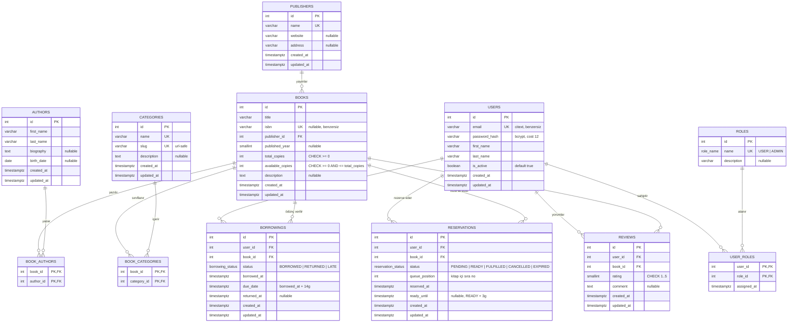
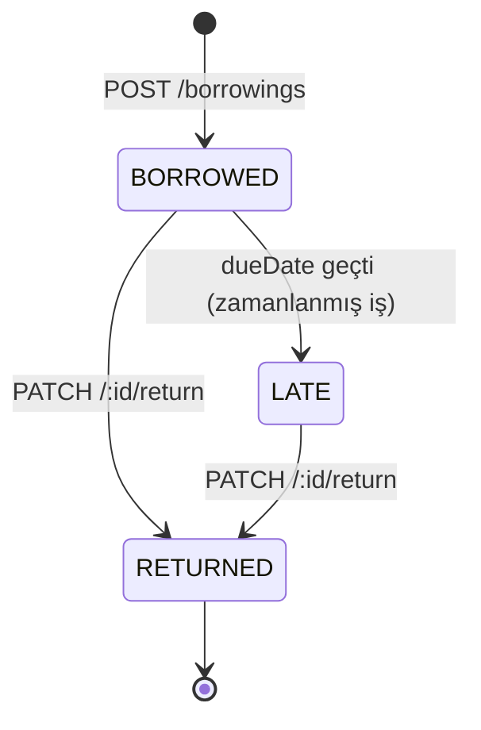
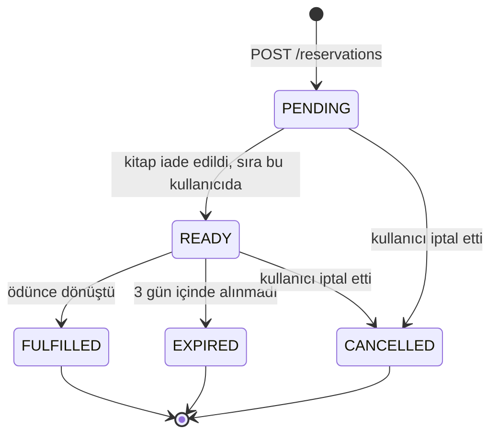

# Sprint 1 — ER Diyagramı

## Genel Görünüm

---

## İlişki Kardinaliteleri

| İlişki | Tip | Ara Tablo | Silme Davranışı |
|---|---|---|---|
| Users ↔ Roles | M:N | `user_roles` | `CASCADE` (kullanıcı silinince rol ataması gider) |
| Books ↔ Authors | M:N | `book_authors` | `CASCADE` ara tabloda, `RESTRICT` author'da |
| Books ↔ Categories | M:N | `book_categories` | `CASCADE` ara tabloda, `RESTRICT` category'de |
| Publishers → Books | 1:N | — | `RESTRICT` (kitabı olan yayınevi silinemez) |
| Users → Borrowings | 1:N | — | `RESTRICT` (geçmiş kayıt korunur) |
| Books → Borrowings | 1:N | — | `RESTRICT` |
| Users → Reservations | 1:N | — | `CASCADE` |
| Books → Reservations | 1:N | — | `CASCADE` |
| Users → Reviews | 1:N | — | `CASCADE` |
| Books → Reviews | 1:N | — | `CASCADE` |

**Gerekçe:** `borrowings` bir *muhasebe kaydıdır* — kimin neyi ne zaman aldığı geçmişi silinmemelidir, bu yüzden `RESTRICT`. Buna karşılık `reviews` ve `reservations` türev veridir; kullanıcı hesabı silinirse birlikte gitmeleri doğrudur.

---

## Ödünç / Rezervasyon Durum Makineleri

### Borrowing

### Reservation

`CANCELLED`, `EXPIRED` ve `FULFILLED` **pasif** durumlardır; `PENDING` ve `READY` **aktif**tir. BR-04.1'deki "tekrar rezervasyon yapılamaz" kuralı yalnızca aktif durumlar için geçerlidir — bu yüzden kısmi (partial) unique index kullanılır, bkz. `03-veritabani-tasarimi.md`.
